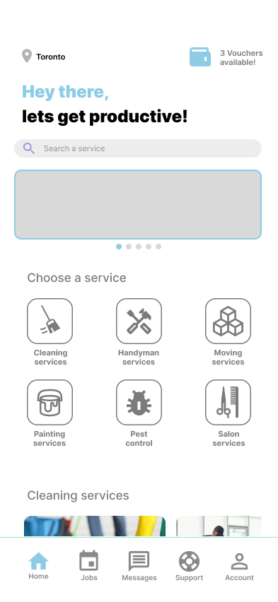

# Quotis

Quotis is a mobile application designed to connect clients with reliable handymen for all sorts of trades work, including plumbing, electrical work, and moving services. We aim to provide a trustworthy and efficient platform where users can find qualified professionals, and service providers can find relevant jobs to make money on the side. Unlike other platforms, Quotis operates on a commission-free model, making it a win-win for both clients and service providers.



## Motivation

Our motivation for building Quotis stems from the shortcomings observed in current handyman service platforms. These platforms often charge high commission fees and feature unverified workers, leading to inconsistent quality of service. Quotis addresses these issues by offering a commission-free model and a rigorous verification process for service providers. This ensures that clients receive high-quality services and professionals can build their reputation without unnecessary financial burdens.

## Installation

To run this project locally, you will need the following tools and programs. Please download them before moving on to the procedure:

- **Node.js**
   - Download Node.js from [here](https://nodejs.org/).
   - **Note**: Installing Node.js will also install npm, which is necessary for setting up the backend, and npx, which will be used to run Expo.

- **Expo CLI**
   - Expo will be used as a simulator for the app
   - Install Expo CLI globally by running the following command:
     ```bash
     npm install -g expo-cli
     ```

## Procedure

1. **Clone the repository and switch into it**:
   ```bash
   git clone https://github.com/UofT-UTSC-CS-sandbox/final-term-project-quotis.git
   cd final-term-project-quotis
   ```

2. **Install dependencies for the backend**:
   ```bash
   cd backend
   npm install
   ```

3. **Run the backend**:
   ```bash
   npm start
   ```

4. **Using a second terminal, set up the frontend**:
   ```bash
   cd final-term-project-quotis/Quotis
   npm install
   ```
   - If you encounter errors with npm install, try:
     ```bash
     npm install --legacy-peer-deps
     ```

5. **Run the application with Expo**:
   ```bash
   npx expo start
   ```

   Once prompted, you will see many ways to simulate the app. Among them are:
   - Press `w` to open the app in a web browser.
   - Press `i` to open the app on an iOS simulator. Make sure that you have Xcode installed and configured.
   

## Contribution
We welcome contributions to the Quotis project. Here is the process for contributing:

1. **Git Flow**: We follow the Git Flow workflow. Please create a feature branch from `develop` for any new features or bug fixes.
2. **Branch Naming**: Use the following naming conventions for branches:
   - `feature/your-feature-name`
   - `bugfix/your-bugfix-description`
3. **GitHub Issues**: We use GitHub Issues for tracking bugs and feature requests. Please ensure you check the existing issues before creating a new one.
4. **Pull Requests**: Submit your pull requests to the `develop` branch. Ensure your code is well-documented and includes tests where applicable.

### How to Contribute (Step-by-Step)
1. Fork the repository.
2. Create a new branch (`git checkout -b feature/your-feature-name`).
3. Make your changes.
4. Commit your changes (`git commit -am 'Add some feature'`).
5. Push to the branch (`git push origin feature/your-feature-name`).
6. Create a new Pull Request.

## Figma
You can view our design prototypes on Figma [here](https://www.figma.com/design/vIzRTsAe7sg3B0jtxXKOT5/Quotis?node-id=0-1&t=OyssGeP0pXk84fiP-1).


## Contact
If you have any questions, feel free to reach out to us at [zuhair.khan@mail.utoronto.ca].
